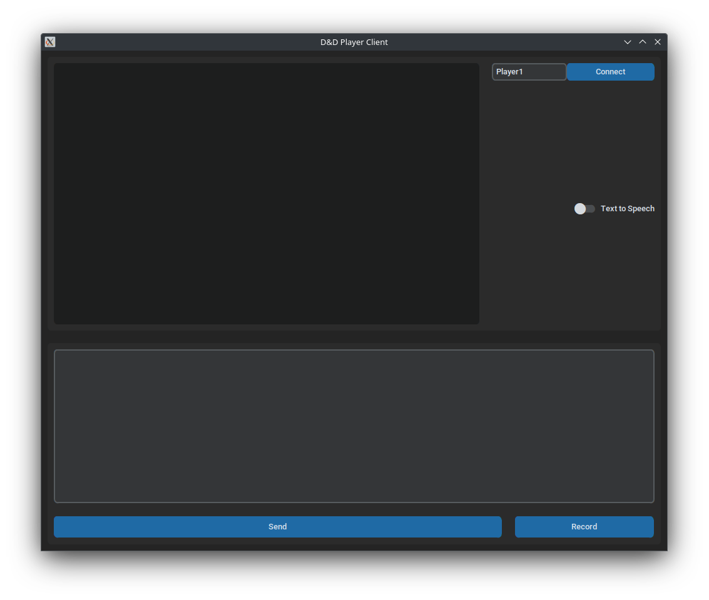
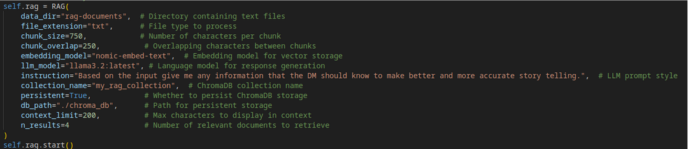

**LLDM**  
Large Language Dungeon Master  
Joel Sander, Nathan DiGilio  
[https://github.com/jds6935/LLDM](https://github.com/jds6935/LLDM)

1. **Base System Functionality**  
1. The game follows this basic loop:  
   1. The agent makes RAG tool calls, asking questions, and getting additional context  
   2. Agent output, giving a scenario to players, and asking for players' actions  
   3. Players give actions  
   4. Agent runs RNG tool to get dice rolls if needed\\  
   5. The agent summarizes what happened up to this point to keep the context short, and excludes RAG context calls from the context  
   6. Return to step 1  
2.  List if scenarios capable  
   1. Tavern social encounters with diverse NPC dialogues.  
   2. Maintaining game state.  
   3. Combat resolution (attack rolls, damage calculation, hit/miss outcomes).  
   4. Detailed narration of player actions (stealth, persuasion attempts, lock-picking outcomes).  
   5. Automated dice rolls for skills, combat, and saves.  
   6. Real-time rules and spell effect lookups.  
   7. Monster stat and lore retrieval during encounters.  
   8. Voiced AI narration for dramatic storytelling.

During the turn hook, the AI creates summaries of the game, contributing to maintaining the game state.  

A GUI was created using tkinter for the player side for ease of connecting and sending actions to the LLDM

2.  **Prompt Engineering and Model Parameter Choice**  
   1. **Parameters,** we found these settings to give a very good response, a low temperature enabled the DM to give very standard responses that fell within the standard of a game of DnD. To offset any repetition and the model choosing “safe” word options, we elected to give it a frequency penalty we found gave more unique responses as the campaign continued. The presence penalty encourages the model to favour tokens that haven’t been used frequently in the generated text, promoting diversity. We thought this would perhaps allow the model to give some unique responses, for example, shop items that may not normally be found without a presence penalty. 2048 max tokens allowed the model to be detailed in its responses and to give enough world-building while also giving the player options at the end of the response.  
      1. temperature: 0.2  
      2. max\_tokens: 2048  
      3. presence\_penalty: 0.6  
      4. frequency\_penalty: 0.3  
   2. **Prompts,** To make the model respond more accurately with the unique game we are giving it, we decided to implement multi-shot prompting to give an example of how to respond when given RAG context.  
   3. This section contributes to all the scenarios  
3. **Tool Usage**  
   1. **Dice Roll,** we implemented a Dice Roll tool call to give truly random number generation for skill checking.  
   2. This section contributes to Automated dice rolls for skills, combat, and saves and Combat resolution  
4. **Planning and Reasoning**  
   1. **Retrieval Augmented Generation,** for every DM turn, the program first asks a RAG model to give any additional information that could be useful with the current context/game state of the DND campaign. It generates a clean response based on the contexts it retrieves and gives it to the DM model.  
5. **RAG Implementation**  
   1. We created a custom-made RAG class that could be imported into the main game file.   
   2. There were many parameters that could be defined when initializing the RAG object  
      1. The directory where the source documents were stored  
      2. The file extension of the documents  
      3. Chunk size (number of characters)  
      4. Chunk overlap size (number of characters)  
      5. Embedding model  
      6. Large Language Model  
      7. Instructions for the large language model  
      8. Context char limit  
      9. Number of document results  
   3. The document we chose is books and manuals that give information about Dungeons & Dragons 5e.  
      1. DnD 5e Player’s Handbook  
      2. DnD 5e Ancestral Weapons  
      3. DnD 5e Monster Manual  
      4. A DnD Dungeons and Dragons \- Adventure Game

4. This section contributes to the monster stat and lore retrieval during encounters and real-time rules and spell effect lookups.  
6. **Additional Tools**  
   1. **Text-to-Speech**  
      1. We are using Coqui-AI TTS models to take the text and make it into .wav files  
      2. We are breaking the dm responses into chunks to load into the model  
         1. This allows the dm to start speaking without processing the entire response  
      3. This feature can be toggled via a toggle button on the UI  
   2. **Speech-to-Text**  
      1. We are using Whisper from OpenAI for STT  
      2. Sounddevice creates temporary .wav files for Whisper  
      3. Whisper takes these .wav files and processes them into text, which is fed into the textbox on the UI   
   3. This contributes to the voiced AI narration for dramatic storytelling.